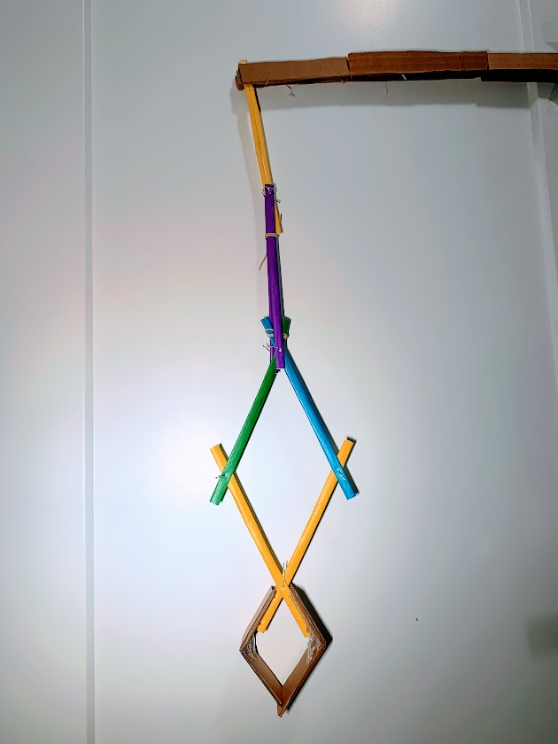
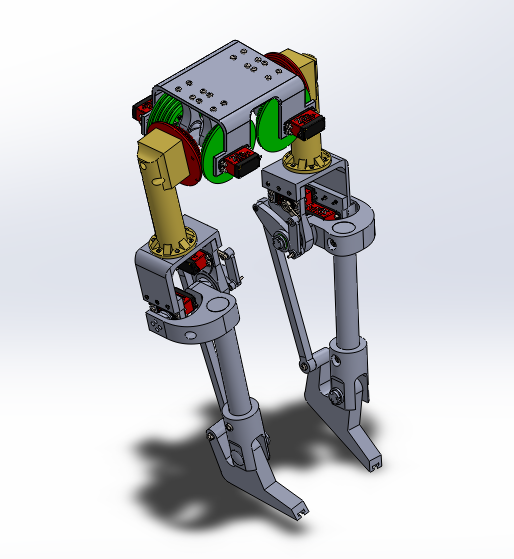
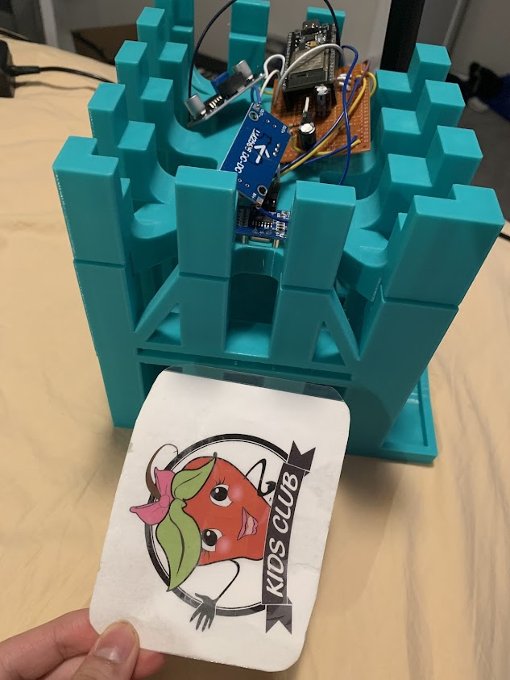
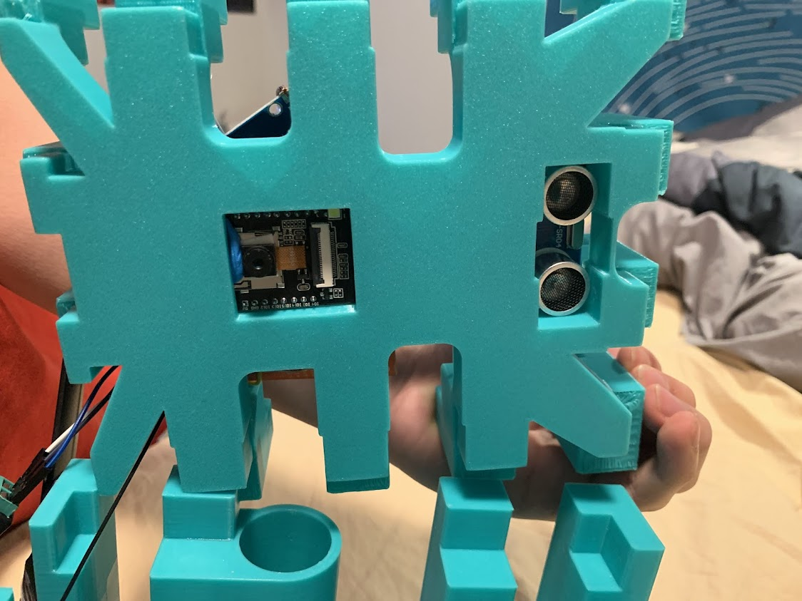
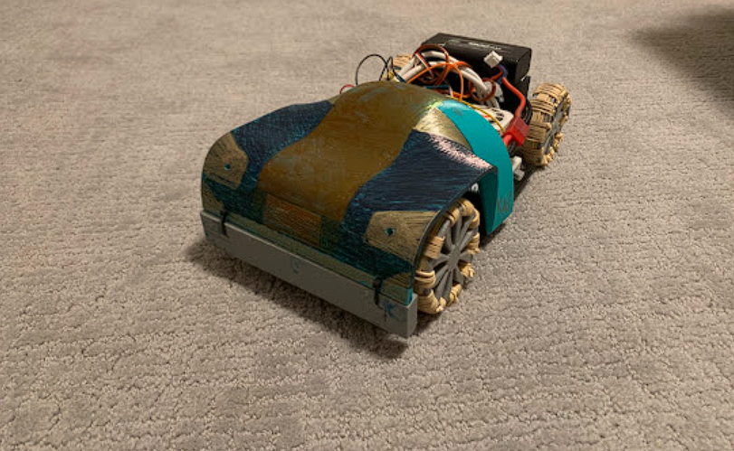
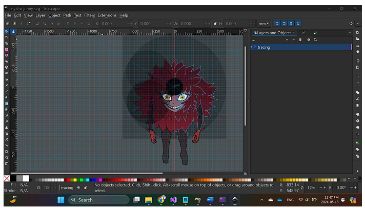
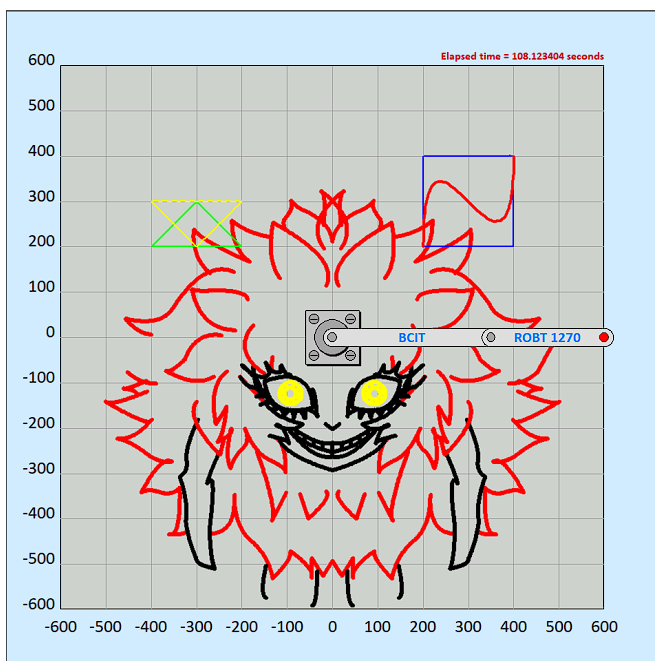

## Table of Contents
- [BCIT Junior Design Engineering Competition](#competition-1-bcit-engineering-competition-2024)
- [Project 1: Humanoid Robot Modeled and Trained in Simulation (In Progress)](#project-1-humanoid-robot-modeled-and-trained-in-simulation-in-progress)
- [Project 2: Sticker Identification for Kid's Game](#project-2-sticker-identification-for-kids-game-in-nesters-market)
- [Project 3: RC Car](#project-3-rc-car)
- [Project 4: Software SPI on MSP430](#project-4-software-spi-on-msp430)
- [Project 5: SCARA Drawing Robot](#project-5-scara-robot-drawing)
- [Contact Information](#contact-information)    
    
  
  
## Competition 1: BCIT Engineering Competition 2024

    

**Description:** Participated in the BCIT Engineering Competition (Junior Design), where the goal was to design and build a device to rescue a person ("Fed") from a high-rise building within 2 hours and 45 minutes. The project combined elements of industrial crane mechanisms and delta robot configurations for precision and efficiency.

**Key Features & Technologies:**
- **Delta Robot Gripper:** Designed a 2D delta robot-inspired gripper using drinking straws for flexibility and lightweight motion.
- **Creative Material Usage:** Used paper clips as joints and reinforced long wooden dowels with cardboard and glue to construct sturdy links.
- **Base Design:** Utilized a cardboard box as the base to provide stability and save time during assembly.
- **Cost Efficiency:** Successfully completed the project with a budget of 90 BEC Bucks out of the allocated 250.
- **Fast Build:** Completed brainstorming, construction, and testing under the competition's tight time constraints.
  
**Presentation Video:** 

**Repository Link:** [BCIT Engineering Competition Repository](https://github.com/trungkhang111005/BCIT-Engineering-Competition-2024.git)    
  
  
  
## Project 1: Humanoid Robot Modeled and Trained in Simulation (In Progress)

    

**Description:** Currently working on designing and simulating a humanoid robot based on the Bruce robot from WESTWOOD Robotics. The project involves replicating the humanoid design and training the robot in a virtual simulation environment.

**Key Features & Technologies:**
- **3D Modeling & Simulation:** Using Solidworks and ROS/Gazebo to model and simulate the robot’s design and functionalities.
- **Motion Planning & Control:** Working on implementing algorithms for dynamic motion control and balance.
- **Reinforcement Learning:** Training the robot to perform basic movements and tasks using reinforcement learning algorithms.
- **Design Inspiration:** The robot’s design and capabilities are inspired by the Bruce robot from WESTWOOD Robotics.

**Repository Link:** [Humanoid Robot Repository (In Progress)](https://github.com/trungkhang111005/Adam.git)    
  
  
  
## Project 2: Sticker Identification for Kid's Game in Nesters Market
 

**Description:** Developed a computer vision system to identify and differentiate stickers for a kid’s game as part of a project for Nesters Market. The goal was to enable a robotic or automated system to recognize stickers and trigger corresponding game actions.

**Key Features & Technologies:**
- **Computer Vision:** Created image processing algorithms using Feature Matching (OpenCV) in Python to detect and classify stickers based on edges and pattern .
- **Actuation:** The result of the image recognition process is used to actuate a servo for a kids' game in Nesters Market where I work part time.
- **Real-World Testing:** Deployed the system in a controlled environment at Nesters Market for live testing with children.
  
**Presentation Videos** 

**Repository Link:** [Sticker Identification System Repository](https://github.com/trungkhang111005/Amanda.git)    
  
  
  
## Project 3: RC Car

    

**Description:** Designed and 3D-printed an RC car modeled after a real-sized automobile. The project aimed to replicate the design and function of a modern vehicle in a scaled-down version.

**Key Features & Technologies:**
- **3D Modeling:** Utilized SolidWorks to create a detailed 3D model of the car’s chassis and parts.
- **Embedded Systems:** Developed the RC system using an Arduino microcontroller to control the car's motors and steering.
- **Motion Control:** Implemented PID controllers for smooth steering and speed regulation.
- **3D Printing & Assembly:** Printed the components and successfully assembled them to create a functional prototype.

**Presentation Videos** 

                       

**Repository Link:** [3D Printed RC Car Repository](https://github.com/trungkhang111005/psychic-engine.git)    
  
  
  
## Project 4: Software SPI on MSP430
**Description:** Developed a software-based SPI (Serial Peripheral Interface) receiver for the MSP430 microcontroller using assembly code. The project aimed to demonstrate low-level SPI communication without hardware support by leveraging GPIO manipulation and precise timing.

**Key Features & Technologies:**

- **Bit-Banging Technique**: Employed bit-banging to manually control clock and data lines, achieving synchronous data capture and storage.
- **Assembly Language**: Programmed in MSP430 assembly for efficient control of data reception and GPIO configuration.
- **Low-Level Communication Protocols**: Implemented an SPI receiver entirely in software, demonstrating mastery in communication protocols and timing-sensitive tasks.
- **Embedded Systems Proficiency**: Designed the project to highlight practical skills in low-level embedded system programming, optimizing for synchronization and data handling.
  
**Repository Link:** [Software SPI Repository](https://github.com/trungkhang111005/software-spi.git)    
  
  
  
## Project 5: SCARA Robot Drawing 

       

**Description:** Created a SCARA (Selective Compliance Assembly Robot Arm) robot capable of drawing intricate designs and shapes by utilizing inverse kinematics and path generation. This project demonstrates precision in robotic movement and control, translating geometric paths into complex, continuous drawings.

**Key Features & Technologies:**

- **Inverse Kinematics**: Implemented algorithms to compute arm positions, allowing accurate translation of geometric paths into physical movement.
- **Geometric Path Generation**: Designed paths using Bézier curves, arcs, and lines for smooth, intricate drawings.
- **Robotic Motion Control**: Enabled precise control over SCARA robot joints, demonstrating expertise in robotic kinematics and movement planning.
- **Application in Art and Automation**: Showcases practical skills in robot programming, with applications in automated art, assembly, and precision tasks.

**Repository Link:** [SCARA Drawing Repository](https://github.com/trungkhang111005/scara-drawing.git)    
  

    
## Contact Information
Feel free to connect with me on [LinkedIn](www.linkedin.com/in/trung-khang-nguyen-900b86203) or reach out via trungkhang1110@gmail.com. I’m always open to discussing robotics projects, collaboration opportunities, or answering any questions about my work.
